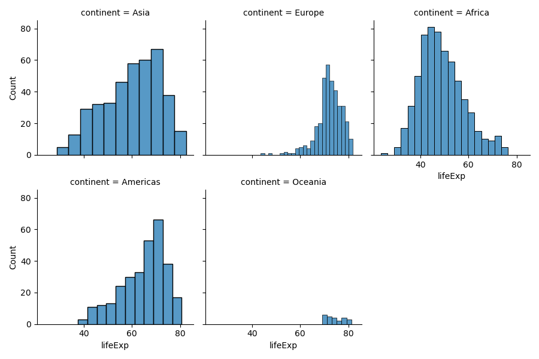
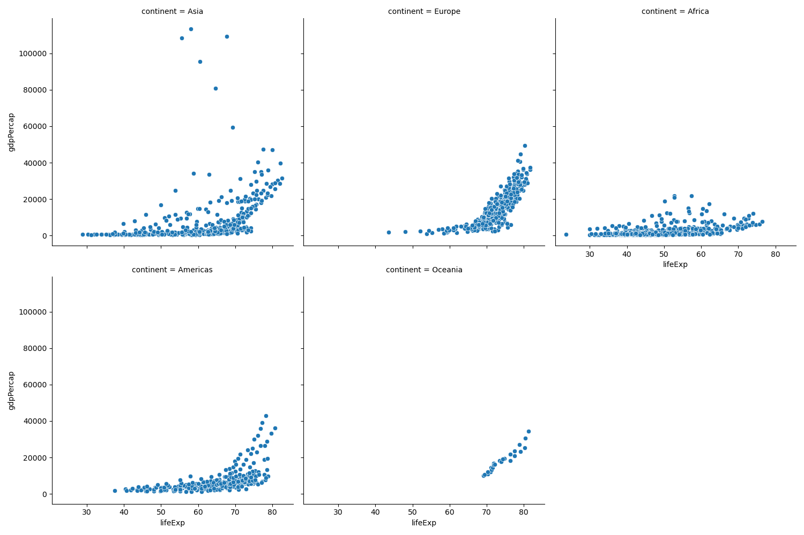

# hw-gapminder

The Repository is set up with a Makefile that has rules to download the data, execute the python files one by one and save its output in figs folder.

## Downloading and Reading the dataset: 
- After cloning the repository, use the following command to download the dataset. This creates a data directory in the local workspace using which you can read the data.

```
make data/gapminder.tsv
```

- Now, I have created a [readit.py](https://github.com/ds5110/hw02-gapminder-Saideep-18/blob/main/src/readit.py) file which has "read_data()" method which reads the file downloaded above and returns a Pandas DataFrame.


## Question 1 -- distribution of life expectancy by continent

- After importing read_data() from readit module and using it to create a Pandas DataFrame, I have used FacetGrid from seaborn to create a plot. The distribution of life expectency for each of the continents. plot has five subplots, one for each of the continents.


- Execute this file using the following make command which would output the following result. The respective output will be generated in figs folder. 

```
make plot1
```



- For Asia, the life expectency is mostly uniform. The life expectency of Europe and Africa is similar to a normal distribution where Europe's peak life expectency is between 60 and 80 years whereas Africa's peak is in between 40 and 60 years. The plot of continent America is similar to that of Europe. Oceania's plot is similar to a uniform data with less records but higher life expectency.


## Question 2 -- time evolution of life expectancy by continent

- FacetGrid is also used to plot the life expectency in each year for every continent. Use the following make command to execute the python file that gives the required plot and the image will be saved in figs folder.

```
make plot2
```


- The entire data has 12 different years and we can see that the life expectency for every continent increases for every year. As the records for Oceania continent are less, its hard to see the box plot clearly for this scale. Except Oceania, there are outliers in each of the continents life expectency data.

## Question 3 -- life expectancy vs GDP

- Use the following make command to execute the python file that results in the required Life Expectency vs GDP plots. 

```
make plot3
```
Linear scale plot:



Log scale plot:


- The linear gdp scale plot and the log gdp scale plot are both same but we can clearly observe that the plot using log scale helps us in understanding the relation better than the plot using linear scale as the scatter points in the linear scale plot are grouped and hard to study. However, the log scale scatter plot is distributed in a more readable way to make any assumptions or conclusions.

## Question 4 -- PDF of life expectancy

- To plot the Probability Density Function of the life expectency of the entire dataset, first we have to normalize the data. There are many ways to do this but I have used the scipy.stats.norm library's pdf function. Use the following make command to run the respective python file and get the result image in figs folder.

```
make plot4
```


- You can see that the probability density curve increases gradually. This indicates that there are more records where countries have recorded higher life expectency that lower life expectency. We have already seen in the previous representations that the life expectency is increasing as the years progressed and a more continents i.e., larger amount of the rows in dataset have the life expectency greater than 40.


### Next Steps:

After executing all the python files using make to get the required results, you can remove the dataset using the `make clean` command. All the plot figures will be saved to figs folder.
